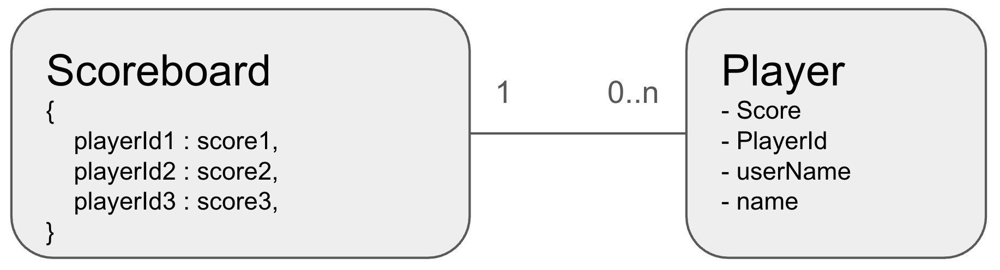
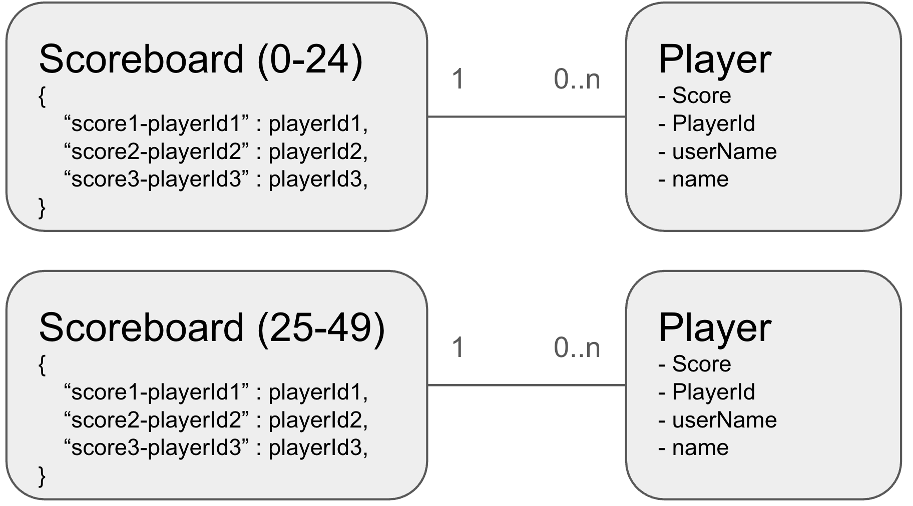

# Leaderboards
[Back to all use cases](../README.md)

[Link to working code](../source/src/main/java/com/aerospike/examples/gaming/Leaderboard.java)

In gaming environments it's quite common to maintin leaderboards -- lists of players who have achieved high scores as well as the scores for the players. Each player has a current score or a best score (depending on the game). As they play the game more, the score is updated as is their position on the leaderboard.

There are a couple of usual queries for this sort of leaderboard:
1. What are the top scores/players on the leaderboard?
2. What is my position on the leaderboard?
3. Who is directly above and below me on the leaderboard?

## Data model
Effectively we want a data model which will keep the scores in a sorted listed. Insertion and deletion must be supported, and the list should maintain sorted order. Aerospike does not natively provide sorting capabilities, but does have the ability to perform map operations sorting by either key or value. 

Unfortunately the keys in a map must be unique -- trying to enter the same key with two different values will result in the second value overwriting the first one. But we could store the player id as the key and then use the score as the value. Once you have the score, you can look up the values around that value or get the associated key, which would give the player id, and hence get the player from that.



This model is likely to work, but has a couple of drawbacks:

1. Aerospike natively stored maps sorted by the key, not the value. There is an option to store an index for the values on the map, but this takes additional storage space and time to read and save the data. If this index is not stored, then the map must be sorted any time the values are needed, costing cpu cycles.

2. There is only one record. This will become an issue for popular games. Popular games can have tens of millions of players, with tens of thousands being online at the same time. This will exceed the nuumber of entries we can store in a single map due to the 8MB limit, and the number of concurrent updates required would likely cause hot key errors.

Let's look at a solution to these problems. 

We can address the first one by forming a composite key for the map. The only problem with having the score as the key to the map is that it is not unique. We could just turn the score into a string and append the player id (which is unique) onto the end of it. This guarantees uniqueness. The value of the map could be the player id again.

Note that in some games, the first person to get a high score keeps the title for that score until someone else gets a higher score. In other games, the most recent person to get the same score keeps the title. In this case, instead of forming a key like `5340-superGamer` (ie score followed by the player id), the date could be inserted in the middle for `score-date-playerId` key. (If you have the requirement for the original player to keep the higher spot instead of the more recent player, change the date to the "time unitl an offest" instead of "time since an offset", so numbers get smaller as time progresses)

To solve the second issue, we can break up the scores into bucketed ranges. For example, let's assume our games has scores in the range of 0 to 6200 (not unusual in games like chess and other strategy games). Instead of one record holding all the scores, let's use many records, each holding a range of 25 scores. So 0-24, 25-49, 50-74, etc:



This model is very scalable (you can divide the buckets into smaller ranges if the records grow too large or there is too much contention on a single record) and has not single records which must be read or written. However, depending on the game there are potentially some downsides too:

1. It's difficult to work out exactly where this person is in the list. Are they ranked 147th or 146? Most of the time this won't make a difference unlesss they're in the top 100 and competing for a title, but that's easy to work out the top ranked people by starting at the largest buckets and working backwards.

2. All the buckets are fixed size. With a games, there are often fewer people at the very top end or very bottom end with many players centered around the middle scores in a typically normal distribution. This could be overcome by splitting records as they become too large, then maintining the records in a doubly-linked list arrangement, with possibly a skip-list style index. This would make it very scalable, but at the cost of performance -- retrieval and saving become O(log N) performance instead of O(1) with the current model.

## Setup
Let's create a Player class. All it needs at this point are a score and an id, but we will add a few extra attributes so we can use it in the [player matching](player-matching.md) use case too.

```java
@AerospikeRecord(namespace = "test", set = "player")
@GenMagic
@Data
public class Player {
    @AerospikeKey
    @GenExpression("$Key")
    private int id;
    private String userName;
    private String firstName;
    private String lastName;
    private String email;
    // When the shield expires, set to 0 if no shield
    @GenExclude
    private long shieldExpiry = 0;
    // Whether this player is online or not.
    @GenExclude
    private boolean online = false;
    
    // if this player is being attacked, who are they attacked by. Set to empty string if not being attacked.
    @GenExclude
    private String beingAttackedBy = "";
    
    // Scores range from 0 to 6200
    @GenNumber(start = 0, end = 6200)
    private int score;
}
```

Generating players is easy, except that we now have 2 sets to update -- the player (to insert the new record) and the scoreboard.
```java
client.truncate(null, playerNamespace, playerSet, null); 
client.truncate(null, scoreboardNamespace, scoreboardSet, null); 

System.out.println("Generating Players");
new Generator(Player.class)
    .generate(1, NUM_PLAYERS, Player.class, player -> {
      mapper.save(player);
      updatePlayerScore(client, player.getId(), -1, player.getScore());
    })
    .monitor();
```

## Updating a player's score
The function `updatePlayerScore` will place the player in the scoreboard. If there is already a score for them it will remove the old score before inserting the new one. It also updates the score on the `Player` record. As this is the first time we're putting the score in the scoreboard, the `oldScore` is passed as `-1` to flag that no old score needs to be removed.

```java
public void updatePlayerScore(IAerospikeClient client, int playerId, int oldScore, int newScore) {
    Utils.doInTransaction(client, txn -> {
        WritePolicy writePolicy = client.copyWritePolicyDefault();
        writePolicy.txn = txn;
        
        Key newBucketKey = getBucketKey(newScore);
        if (oldScore < 0) {
            // This is just an insert
            String mapKey = getMapKey(playerId, newScore);
            
            client.operate(writePolicy, newBucketKey, 
                    MapOperation.put(MAP_POLICY, SCOREBOARD_BIN, Value.get(mapKey), Value.get(playerId)));
        }
        else {
            String newMapKey = getMapKey(playerId, newScore);
            String oldMapKey = getMapKey(playerId, oldScore);

            if (determineBucketForScore(newScore) == determineBucketForScore(oldScore)) {
                // These are in the same record, they can be done atomically
                client.operate(writePolicy, newBucketKey, 
                        MapOperation.removeByKey(SCOREBOARD_BIN, Value.get(oldMapKey), MapReturnType.NONE),
                        MapOperation.put(MAP_POLICY, SCOREBOARD_BIN, Value.get(newMapKey), Value.get(playerId)));
            }
            else {
                // The keys are in two separate buckets. Must be done in two separate cals
                Key oldBucketKey = getBucketKey(oldScore);
                client.operate(writePolicy, oldBucketKey, 
                        MapOperation.removeByKey(SCOREBOARD_BIN, Value.get(oldMapKey), MapReturnType.NONE));
                client.operate(writePolicy, newBucketKey,
                        MapOperation.put(MAP_POLICY, SCOREBOARD_BIN, Value.get(newMapKey), Value.get(playerId)));
            }
        }
        if (oldScore >= 0) {
            // Update the record if there was an old score.
            client.put(writePolicy, new Key(playerNamespace, playerSet, playerId), new Bin("score", newScore));
        }
    });
}
```

## Displaying scores around a particular user
One of the key functions will be to show the people above and below a target user. So if the target user is user 1, we will show:
```
Score |                     User Name                      |  Id 
-----------------------------------------------------------------
 2062 |                                        et corporis | 42548
 2062 |                                              quasi | 45968
 2062 |                                            eum qui | 69392
 2062 |                reprehenderit minus sit ea possimus | 89826
 2062 |                         voluptatibus voluptatem et | 97248
 2062 |                            sunt dolores laboriosam | 98916
 2063 |                                         ad debitis | 1
 2063 |                    aliquam consectetur autem fugit | 3510
 2063 |                                           qui quod | 5102
 2063 |                                      dolorum eaque | 11544
 2063 |                                               sint | 29028
 2063 |                                         voluptates | 33816
 2063 |                                            id vero | 38428
```
We're going to use `ExpOperations` for this to allow filtering of data using expressions, as the records could potentially be large. Let's consider the record structure discussed earlier and look for scores around the score of player 1. We will assume we want 5 scores above and below:

```json
"score": {
    "04975-000002015": 2015,
    "04975-000003776": 3776,
    "04977-000004893": 4893,
    "04977-000005107": 5107,
    "04977-000006051": 6051,
    "04978-000009377": 9377,      <-- Lower Limit
    "04979-000002083": 2083,
    "04979-000006355": 6355,
    "04981-000002279": 2279,
    "04981-000008179": 8179,
    "04982-000000001": 1,         <-- Current record
    "04982-000000913": 913,
    "04984-000002093": 2093,
    "04984-000007592": 7592,
    "04985-000001238": 1238,
    "04985-000003659": 3659,      <-- Upper Limit
    "04985-000005174": 5174,
    "04985-000008589": 8589,
    "04986-000002067": 2067,
    "04987-000000533": 533,
    "04987-000002374": 2374,
}
```

### Getting low-side players
So the algorith we will use on a record will first get the five records before our target recod:
1. Find the index of player 1's score. As we're using `KEY_ORDERED` maps, we know the index will be the same as the rank and they will be in sorted order. So we can use `MapExp.getByKey` to give the index of the record for player 1 (using `"04982-000000001"` as our key):
```java
  Exp.def("index",
    MapExp.getByKey(
      MapReturnType.INDEX,
      Exp.Type.INT,
      Exp.val(mapKey),
      Exp.mapBin(SCOREBOARD_BIN)
    )
  ),
```
2. Compute the lower bound, which is the index (determined in step 1) minus 5. **But** we have to make sure don't underflow: if the index returned 2, and we wanted 5 elements we would compute this as -3. Aerospike treats negative numbers as starting from the end of the map, so -3 would be the third __highest__ index in the map, which is definitely not what we want. So we need to check if we're going to underflow, and if so use zero instead.
```java
  Exp.def("startIndex",
    Exp.cond(
      Exp.ge(
        Exp.var("index"), 
        Exp.val(numPlayersEitherSide)
      ), Exp.sub(Exp.var("index"), Exp.val(numPlayersEitherSide)),
      Exp.val(0)
    )
  ),
```
3. Compute the count of records. This isn't just "five" due to the same underflow issue discussed above, so we need to see if our index is > 5 and if not, set the count to be the index:
```java
  Exp.def("count",
    Exp.cond(
      Exp.ge(
        Exp.var("index"), 
        Exp.val(numPlayersEitherSide)
      ), Exp.val(numPlayersEitherSide),
      Exp.var("index")
    )
  ),
```
4. Now that everything is set up, just use `MapExp.getByIndexRange` with our computed index and count to get the desired records. Note in this case the `key` of the map contains both the player id and the score, so that's all we need:
```java
  MapExp.getByIndexRange(
    MapReturnType.KEY,
    Exp.var("startIndex"),
    Exp.var("count"),
    Exp.mapBin(SCOREBOARD_BIN)
  )
```

This gives us the records on the low side of our target record, but it might be short. If our index is 2 and we want 5 records, this expression will give us just 2. We need to check the block(s) before ours to load the extra 3 records. We will get back the low side players in one variable (`lowerPlayers`), and if is less than we want we need to load the last records in the previous block. We can simply use a negative offet for this (remember that `-4` will start 4 items from the end of the map) and go to the end of the map, prepending these items onto our list of items already returned. If this doesn't give us enough records, repeat the process:
```java 
private void addOverflowLowerPlayersIfNeeded(IAerospikeClient client, List<String> currentPlayers, int playerBucket, int numPlayersEitherSide) {
    int currentBucket = playerBucket;
    while (currentBucket-- >= 0 && currentPlayers.size() < numPlayersEitherSide) {
        Record result = client.operate(null, new Key(scoreboardNamespace, scoreboardSet, currentBucket),
                MapOperation.getByIndexRange(SCOREBOARD_BIN, currentPlayers.size()-numPlayersEitherSide, MapReturnType.KEY));
        if (result != null) {
            currentPlayers.addAll(0, (List<String>) result.getList(SCOREBOARD_BIN));
        }
    }
}
```

### Getting high-side players
Getting the players higher than our target player is easer as we don't need to worry about underflow, and overflow will just silently give us only the records it can. So if there are 10 records in the map, and we ask for 5 from index 8, we will only get 2 records. 

Note that we will want our target player in the output set too, so we have to add one more record (returning 6 on the high side, including this player). Our expression is:
```java
Exp higherPlayers = Exp.let(
  Exp.def("index",
    MapExp.getByKey(
      MapReturnType.INDEX,
      Exp.Type.INT,
      Exp.val(mapKey),
      Exp.mapBin(SCOREBOARD_BIN)
    )
  ),
  MapExp.getByIndexRange(
    MapReturnType.KEY,
    Exp.var("index"),
    Exp.val(numPlayersEitherSide+1),
    Exp.mapBin(SCOREBOARD_BIN)
  )
);
```

And the overflow method becomes:
```java
private void addOverflowHigherPlayersIfNeeded(IAerospikeClient client, List<String> currentPlayers, int playerBucket, int numPlayersEitherSide) {
    int currentBucket = playerBucket;
    while (currentBucket++ <= MAX_BUCKETS && currentPlayers.size() < numPlayersEitherSide+1) {
        Record result = client.operate(null, new Key(scoreboardNamespace, scoreboardSet, currentBucket),
                MapOperation.getByIndexRange(SCOREBOARD_BIN, 0, numPlayersEitherSide+1 - currentPlayers.size(), MapReturnType.KEY));
        if (result != null) {
            currentPlayers.addAll((List<String>) result.getList(SCOREBOARD_BIN));
        }
    }
}
```

### Putting it all together
The whole code to get the list of players either side of the target player is:
```java
public List<Player> getScoresAroundPlayer(IAerospikeClient client, int playerId, int score, int numPlayersEitherSide) {
    String mapKey = getMapKey(playerId, score);

    Exp lowerPlayers = Exp.let(
      Exp.def("index",
        MapExp.getByKey(
          MapReturnType.INDEX,
          Exp.Type.INT,
          Exp.val(mapKey),
          Exp.mapBin(SCOREBOARD_BIN)
        )
      ),
      Exp.def("startIndex",
        Exp.cond(
          Exp.ge(
            Exp.var("index"), 
            Exp.val(numPlayersEitherSide)
          ), Exp.sub(Exp.var("index"), Exp.val(numPlayersEitherSide)),
          Exp.val(0)
        )
      ),
      Exp.def("count",
        Exp.cond(
          Exp.ge(
            Exp.var("index"), 
            Exp.val(numPlayersEitherSide)
          ), Exp.val(numPlayersEitherSide),
          Exp.var("index")
        )
      ),
      MapExp.getByIndexRange(
        MapReturnType.KEY,
        Exp.var("startIndex"),
        Exp.var("count"),
        Exp.mapBin(SCOREBOARD_BIN)
      )
    );
    
    Exp higherPlayers = Exp.let(
      Exp.def("index",
        MapExp.getByKey(
          MapReturnType.INDEX,
          Exp.Type.INT,
          Exp.val(mapKey),
          Exp.mapBin(SCOREBOARD_BIN)
        )
      ),
      MapExp.getByIndexRange(
        MapReturnType.KEY,
        Exp.var("index"),
        Exp.val(numPlayersEitherSide+1),
        Exp.mapBin(SCOREBOARD_BIN)
      )
    );

    int playerBucket = determineBucketForScore(score);
    Record result = client.operate(null, getScoreboardKey(score), 
            ExpOperation.read("lowerPlayers", Exp.build(lowerPlayers), ExpReadFlags.DEFAULT),
            ExpOperation.read("higherPlayers", Exp.build(higherPlayers), ExpReadFlags.DEFAULT)
        );
    List<String> lowerPlayersList = (List<String>) result.getList("lowerPlayers");
    List<String> higherPlayersList = (List<String>) result.getList("higherPlayers");

    // Check to see if blocks overflowed
    addOverflowLowerPlayersIfNeeded(client, lowerPlayersList, playerBucket, numPlayersEitherSide);
    addOverflowHigherPlayersIfNeeded(client, higherPlayersList, playerBucket, numPlayersEitherSide);
    
    List<Player> allPlayers = new ArrayList<>(lowerPlayersList.size() + higherPlayersList.size());
    lowerPlayersList.forEach(item -> allPlayers.add(mapKeyToScoreDetails(item)));
    higherPlayersList.forEach(item -> allPlayers.add(mapKeyToScoreDetails(item)));

    return allPlayers;
}
```

## Running the demonstration
Running the demonstration is easy. We need a set of threads to do various things:
1. Show the leaderboard every so often
2. Update player 1's score
3. Update other players' scores.

Note that the scoreboard is the scores around player 1 and hence the score for player 1 cannot change as we're loading the data for the leaderboard. If it did, we might invoke the `getScoresAroundPlayer` function with a score of 1001, but before the call has started loading the data, the player's score changes to 999. This is in a different record altogether, and the code which looks for the index of that player with their score will not find them, causing unusual behavior.

We could work around this with transactions, but it would be expensive in terms of locking. Also, it's an unrealstic use case -- when player 1 finishes the game, you would update their score and show the scoreboard. Hence these two operations are synchronized with each other to prevent them executing at the same time.

To manange the threads, we're going to use a __very__ small helper class called `Async`:
```java
Async.runFor(Duration.ofSeconds(20), (async) -> {
    // Show the scoreboard every 2 seconds.
    async.periodic(Duration.ofSeconds(SCOREBOARD_DISPLAY_PERIOD), () -> {
        synchronized (async) {
            showPlayersAroundPlayer(client, playerId, scoreVal.get());
        }
    });
    
    // Change the main player score every 50ms, having it slowly creep up randomly
    async.periodic(Duration.ofMillis(PLAYER1_UPDATE_PERIOD), () -> {
        synchronized (async) {
            int currentScore = scoreVal.get();
            int newScore = changeScore(currentScore, 1);
            updatePlayerScore(client, playerId, currentScore, newScore);
            scoreVal.set(newScore);
        }
    });
    
    // Update a random player's score
    async.periodic(Duration.ofMillis(THREAD_UPDATE_PERIOD), NUM_THREADS, () -> {
        // Ensure we do not update player 1's score in this thread
        int playerIdToChange = async.rand().nextInt(NUM_PLAYERS-1)+2;
        Record record = client.get(null, new Key(playerNamespace, playerSet, playerIdToChange));
        if (record != null) {
            int currentScore = record.getInt("score");
            updatePlayerScore(client, playerIdToChange, currentScore, changeScore(currentScore));
        }
        
    });
});

```
This code will run for 20 seconds (unless the started threads terminate it early). It then launches 3 `periodic` tasks, ie ones which wake up and perform actions then go back to sleep for the specified period. These three takes correspond to the three points listed at the start of this section.

Note that if you want to run something as quickly as possible with no delay, you can also use the `continuous` block. If you use this ensure that you're not looping within the `contninous` block, you're performing one action per invocation. For example, if the last action didn't want a 5ms delay, but rather updated players' scores as quickly as possible, you could do:
```java
async.continuous(NUM_THREADS, () -> {
    // Ensure we do not update player 1's score in this thread
    int playerIdToChange = async.rand().nextInt(NUM_PLAYERS-1)+2;
    Record record = client.get(null, new Key(playerNamespace, playerSet, playerIdToChange));
    if (record != null) {
        int currentScore = record.getInt("score");
        updatePlayerScore(client, playerIdToChange, currentScore, changeScore(currentScore));
    }
    
});
```
The `NUM_THREADS` parameter says that we want to start this many workers. If this is omitted, one instance is started.
