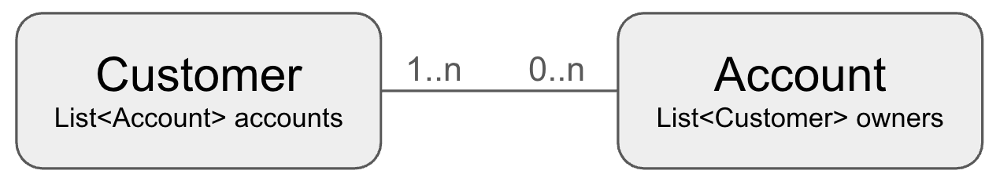

# Managing Many to Many relationships
There are many situations where groups of two different entities are related together. Consider a banking scenario -- a customer might own multiple accounts, and each of those accounts might be owned by multiple people. In SQL this sort of data model would require a join table to resolve the many-to-many relationship, as well as potentially a couple of indexes for efficient retrieval.

Since Aerospike can hold complex data types like lists and maps inside its `Record` structure, we can model this more effiecintly in Aerospike without the need either for join tables nor secondary indexes.

Consider this solution to the many to many problem:


Here, each `Customer` has a list of the ids of the `Account`s it owns, and each `Account` has a list of the `Customer`s who own it. Any manipulation of these relationships will require transaction support, so we will make use of the transactional helper described [here](one-to-many-relationships.md#transaction-handling).

## Data Model
```java
@AerospikeRecord(namespace = "${demo.namespace:test}", set = "customer")
@Data
@NoArgsConstructor
@GenMagic
public class Customer {
    @AerospikeKey
    @GenExpression("'Cust-' & $Key")
    private String custId;
    private String firstName;
    private String lastName;
    private Date dob;
    private Date dateJoined;
    @GenExclude
    private List<Account> accounts;
}

@Data
@NoArgsConstructor
@GenMagic
@AerospikeRecord(namespace = "${demo.namespace:test}", set = "account")
public class Account {
    @AerospikeKey
    private UUID id;
    private String accountName;
    private int balanceInCents;
    private Date dateOpened;
    @GenExclude
    private List<Customer> owners;
}
```

We're using UUIDs as the account id, and in reality it would make sense for the customer id to be a UUID too. However, we need to be able to find a particular customer for our test harness, and using a UUID than just a String derived from a makes this challenging. However, the `Account` handling will show how to handle UUIDs in Aerospike. 

## Populating data
Let's populate 1,000 customers who have 2,000 accounts between them. Each account will be owned by anywhere from one customer to 8.
```java
public void setup(IAerospikeClient client, AeroMapper mapper) throws Exception {
    client.truncate(null, mapper.getNamespace(Customer.class), mapper.getSet(Customer.class), null);
    client.truncate(null, mapper.getNamespace(Account.class), mapper.getSet(Account.class), null);
    
    System.out.println("Generating Customers");
    new Generator(Customer.class)
        .generate(1, NUM_CUSTOMERS, Customer.class, mapper::save)
        .monitor();
    
    System.out.println("\nGenerating Accounts");
    new Generator(Account.class)
        .generate(1, NUM_ACCOUNTS, Account.class, account -> {
            int numAccountOwners = ThreadLocalRandom.current().nextInt(1,8);
            // Generate a list of the account owners
            List<String> ownerIds = IntStream.range(1, numAccountOwners+1)
                    .mapToObj(num -> "Cust-" + (ThreadLocalRandom.current().nextInt(NUM_CUSTOMERS) +1))
                    .collect(Collectors.toList());
            
            addAccount(client, mapper, account, ownerIds);
        })
        .monitor();
}
```
We generate the customers first, then the accounts. For each account the generator will automatically populate the values except for the `owners`. We generate a list of the ids we want as owners, and then call `addAccount` passing the list of owners and the account details.

## Adding an account
To add an account, we will take the account and the list of `ownerIds`. If the objects have already been loaded and populated, the `Account` would have list of `Customer`s in which case the ids could be found in these business objects. However, when a new `Account` is created, it is probably part of the account creating process to create the account and associate it with a list of customers, typically not requiring the `Customer`s to be loaded first.

```java
public boolean addAccount(IAerospikeClient client, AeroMapper mapper, Account account, List<String> ownerIds) {
    Key accountKey = new Key(mapper.getNamespace(Account.class), mapper.getSet(Account.class), account.getId().toString());
    
    return Utils.doInTransaction(client, txn -> {
        WritePolicy writePolicy = client.copyWritePolicyDefault();
        writePolicy.txn = txn;
        
        client.put(writePolicy, accountKey, 
               new Bin("id", account.getId().toString()),
               new Bin("accountName", account.getAccountName()),
               new Bin("balanceInCents", account.getBalanceInCents()),
               new Bin("dateOpened", account.getDateOpened() == null ? 0 : account.getDateOpened().getTime()),
               new Bin("owners", ownerIds));
       
        BatchPolicy batchPolicy = client.copyBatchPolicyDefault();
        batchPolicy.txn = txn;
        
        // For each owning customer, we want to insert into  the `accounts` list using set-like behavior
        String customerNamespace = mapper.getNamespace(Customer.class);
        String customerSet = mapper.getSet(Customer.class);

        Key[] keys = ownerIds.stream()
                .map(id -> new Key(customerNamespace, customerSet, id))
                .toArray(Key[]::new);
        
        ListPolicy setLikeListPolicy = new ListPolicy(ListOrder.ORDERED, ListWriteFlags.ADD_UNIQUE | ListWriteFlags.NO_FAIL);
        batchPolicy.txn = null;
        BatchResults results = client.operate(batchPolicy, null, keys, Operation.array(
                ListOperation.append(setLikeListPolicy, "accounts", Value.get(account.getId().toString()))
            ));
        
        return results.status;
    });
}
```
For a discussion on the flags used on the list and the reason why, please see [this discussion](one-to-many-relationships.md#adding-a-listing-to-an-agent)

Let's look at some of the data to make sure it looks good:
```
PK: "Cust-1"
*************************** 1. row ***************************
custId: "Cust-1"
dateJoined: 1742199103178
dob: -972590015955
firstName: "Rufus"
lastName: "King"
accounts: LIST('["01577899-affb-4e56-b303-842f11438819", "a23f5a04-4b9c-4a49-9add-db03ed2cb08e", "bbb3354c-0582-45b4-9a4f-7d81e548f74e", "fd22a729-6e38-458b-8244-0b9ab40b954f"]')

1 row in set (0.000 secs)

OK

aql> select * from test.account where pk = "01577899-affb-4e56-b303-842f11438819"
PK: "01577899-affb-4e56-b303-842f11438819"
*************************** 1. row ***************************
id: "01577899-affb-4e56-b303-842f11438819"
accountName: "Delora Runolfsson Sr.'s account"
balanceInCents: 6037
dateOpened: 1731048848199
owners: LIST('["Cust-1", "Cust-114", "Cust-358", "Cust-847"]')

1 row in set (0.000 secs)

OK
```
Here you can see that the first customer (`Cust-1`) has 4 accounts. One of those accounts (`Joshua Kunze's account`) has an id of `01577899-affb-4e56-b303-842f11438819`. If we query that account, we see that it is owned by 5 people, one of whom is `Cust-1`. Bi-directional linking is working!

(Note: All the test data is randomly generated. Hence you will get different results when running the test harness yourself, but the concepts still apply.)

## Querying the data model.
Given that a `Customer` has a list of `Account`s, and an `Account` has a list of `Customer`s, querying either list from a single instance of the other (ie getting the list of `Account`s for a `Customer`, or getting the list of `Customer`s who own an `Account`) is identical to querying a one-to-many relationship, so see [how to do this here](one-to-many-relationships.md#getting-all-the-listings-for-one-agent).

Instead, let's play a bit. Suppose we want to find out which `Customer`s are related to a given `Customer`. By related, we mean that they share at least one account. So if we have customer C<sub>1</sub>, we want to find all other customers C<sub>2</sub>, C<sub>3</sub>...C<sub>N</sub> such that C<sub>1</sub> and C<sub>k</sub> are both owners on an account A<sub>x</sub> for any `x`.

The solution is actually fairly easy when power of Aerospike batch reads is used:
```java
public Map<String, Integer> getRelatedCustomers(IAerospikeClient client, AeroMapper mapper, String customerId) {
    Key customerKey = new Key(mapper.getNamespace(Customer.class), mapper.getSet(Customer.class), customerId);
    String accountNs = mapper.getNamespace(Account.class);
    String accountSet = mapper.getSet(Account.class);
    
    Record record = client.get(null, customerKey, "accounts");
    if (record != null) {
        List<String> accountIds = (List<String>) record.getList("accounts");
        Key[] accountKeys = accountIds.stream()
                .map(id -> new Key(accountNs, accountSet, id))
                .toArray(Key[]::new);
        
        Record[] records = client.get(null, accountKeys, "owners");
        
        // Now use Java streams to process into the map, extracting elements out of the 
        // lists of each record
        List<Record> recordList = Arrays.asList(records);
        Map<String, Integer> counts = recordList.stream()
                .flatMap(rec -> {
                    List<String> list = (List<String>) rec.getList("owners");
                    return list == null ? Stream.empty() : list.stream();
                })
                .filter(id -> !customerId.equals(id))
                .collect(Collectors.groupingBy(
                        Function.identity(),
                        Collectors.reducing(0, e->1, Integer::sum)
                ));
        
        return counts;
    }
    return Map.of(); 
}
```

The customer is queried to get the list of accounts they own. We only need this bin, so we pass `"account"` as the list of bins to return to the `get` call. This minimizes network traffic in case the rest of the object is large.

The `accounts` list contains the accounts ids that this customer owns. Each of those accounts hsa an `owners` bin (a list) which holds the customer ids of the account owners. So performing a batch get of the `owners` bin on all the `accounts` will give us the raw data. 

Once we have this raw data, it's just a matter of extracting the bin, removing the passed id from the list and grouping it by the customer id. A little bit of Java stream magic, and we get our map back! 

Note that in this example we're not using transactions. We're only reading the data, and it's statistical data so if the data changes as it's being read, this might not matter. Typically you would use business logic to determine which parts of your calls (if any) should be transactional. 

## Breaking associations
Since both Customers and Accounts have business meaning in their own rights, and it would be unusual to actually delete either of these entities due to legal auditing requirements, let's look at breaking the relationship between two entities:

```java
public void removeAssociation(IAerospikeClient client, AeroMapper mapper, String customerId, String accountId) {
    Key customerKey = new Key(mapper.getNamespace(Customer.class), mapper.getSet(Customer.class), customerId);
    Key accountKey = new Key(mapper.getNamespace(Account.class), mapper.getSet(Account.class), accountId);
    
    // Remove the customerId from the account object, remove the account id from the customer object
    Utils.doInTransaction(client, txn -> {
       WritePolicy writePolicy = client.copyWritePolicyDefault();
       writePolicy.txn = txn;
       
       // Remove the accountid from the customer
       Record rec = client.operate(writePolicy, customerKey, ListOperation.removeByValue("accounts", Value.get(accountId), ListReturnType.EXISTS));
       if (rec.getBoolean("accounts")) {
           // Remove the recordid from the account
           rec = client.operate(writePolicy, accountKey, ListOperation.removeByValue("owners", Value.get(customerId), ListReturnType.EXISTS));
           if (!rec.getBoolean("owners")) {
               
               throw new IllegalStateException(String.format(
                       "Account record for key '%s', should contain customer id '%s' in it's owners list, but does not",
                       accountId, customerId));
               
           }
       }
       else {
           throw new IllegalStateException(String.format(
                   "Customer record for key '%s', should contain account id '%s' in it's account list, but does not",
                   customerId, accountId));
       }
    });
}
```

Here we simply perform two operations which are very similar to one another -- removing the id of an enitiy from the list of enities in the other. For example, removing the customer id from the list of customers in the account, and vice versa. To preserve referential integrity we wrap both of these actions inside a transaction.

Note that you might be tempted to do the two operations inside a batch operation. While this would work, it is likely to be slower than doing them sequentially with point writes due to the overhead of starting batches. This is especially true if the batch was to be executed with multiple threads. As the number of operations gets larger the benefit of batches becomes more and more apparent, but for very small numbers of reads or writes like one or two, it is often faster just to do key-value operations.
