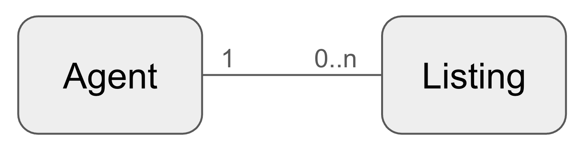
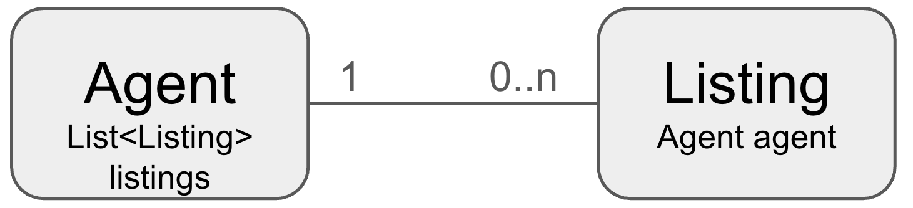

# Managing One to Many relationships
There are many situations where one entity is related to many instances of another sort of entity. Both parent and children may need to be accessed directly, without starting from the other entity, and hence are related via association and not aggregation. 

Examples of associated relationships include:
- A department can have many employees, but employees only belong to one department.
- A real estate agent can have many property listings, but a property is only listed by one agent.
- Financial institution customers can have many accounts. However, accounts can be owned by multiple customers so this is a many-to-many relationship and hence will be covered in a different use case.

Examples of aggregations (where the "many" might be aggregated into the "one") might include:
- Customers have multiple addresses.
- A credit card has multiple transactions.

There are two different possible implementations for one-to-many relationships in aerospike, typically depending on the cardinality of the many:
- Have the "many" entity store the ID of the "one" and define a secondary index on the 

it makes in a bank there are Customers and Accounts. A customer can have multiple accounts, and accounts can be owned by multiple customers.

In relational databases this many-to-many relationship would result in a foreign key from the many to the one, and probably an index to be able to efficiently retieve the "many" value.

In Aerospike, if the number of the "many" is very large (thousands or more) then it makes sense to model the data this way too. The "many" object would hold the id of the "one" and a secondary index query used to discover all of the related entities associated with a particular entity. 

For smaller cardinalities, or situations where the many have to be retrieved as quickly as possible, it makes sense to model the data another way. 

Let's consider a real estate use case where a real estate agent has many listings.


In this example, it's common to either want to access the agent from the listing, for example finding all the properties in a zip code, select a desired listing and then discover the agent listing it. It is also common to want to see all the listings for a particular agent. So in this case there is no dominant entitiy -- the query can run in either direction.

To model this in Aerospike we will use the following entities:
```java
@AerospikeRecord(namespace = "${demo.namespace:test}", set = "listing")
@GenMagic
@NoArgsConstructor
@AllArgsConstructor
@Data
public class Listing {
    @GenExpression("'Listing-' & $Key")
    @AerospikeKey
    private String id;
    private String line1;
    private String line2;
    private String city;
    @GenAddress(AddressPart.STATE_ABBR)
    private String state;
    private String zipCode;
    private String url;
    private Date dateListed;
    @GenExclude
    private long agentId;
    private String description;
}

@AerospikeRecord(namespace = "${demo.namespace:test}", set = "agent")
@Data
@GenMagic
public class Agent {
    @GenExpression("$Key")
    @AerospikeKey
    private long agentId;
    private String firstName;
    private String lastName;
    private String email;
    private String phoneNum;
    private Date regDate;
    @GenExclude
    private List<Listing> listings;
    
    public Agent() {
        this.listings = new ArrayList<>();
    }
}
```

So a Listing has the `agent` field to refer back to the agent, and the Agent has the `listings` field (a list) to hold references to the listing for that agent.


The `@GenExpression` takes an expression and parses it into a value when generating an object. The `$Key` variable of type long refers to a counter maintained by the generator when it creates an object. So the format of the listing ids will be `Listing-1`, `Listing-2`, etc, and the agent ids will just be numbers. Note that this variable is case sensitive. You can also pass your own parameters into the generator and reference them with `$` followed by the name.

Note that we will be associating the agents and the listing in Java code, so we do not want default values generated for us. Hence, bot the `agentId` field in the `Listing` class, and the `listings` field in the `Agent` class have been flagged to not have any values generated for them. Also, `state` is such a generic term that `@GenMagic` doesn't know that it's part of an address, so it has been explicitly marked to generate the correct value. However, if the class was called "Address" or similar, then `@GenMagic` __would__ correctly generate a state.

Let's generate 1,000 agents and 5,000 listings:
```java
@Override
public void setup(IAerospikeClient client, AeroMapper mapper) throws Exception {
    client.truncate(null, mapper.getNamespace(Agent.class), mapper.getSet(Agent.class), null);
    client.truncate(null, mapper.getNamespace(Listing.class), mapper.getSet(Listing.class), null);
    final int NUM_LISTINGS = 5_000;
    final int NUM_AGENTS = 1_000;
    
    System.out.println("Generating Agents");
    new Generator(Agent.class)
        .generate(1, NUM_AGENTS, Agent.class, mapper::save)
        .monitor();
    
    System.out.println("\nGenerating Listings");
    new Generator(Listing.class)
        .generate(1, NUM_LISTINGS, Listing.class, mapper::save)
        .monitor();
    
    System.out.println("\nAssociating listings with agents");
    for (int i = 1; i <= NUM_LISTINGS; i++) {
        String listingId = "Listing-" + i;
        int agentId = ThreadLocalRandom.current().nextInt(NUM_AGENTS);
        addListingToAgent(client, mapper, listingId, agentId);
    }

}
```
So, 1,000 agents will be generated, then 5,000 listings, then we need to associate each listing with a single agent. This introduces our first business method `addListingToAgent`

## Adding a Listing to an Agent
Associating a listing with an agent requires both the listing and the agent to be updated, as they cross-reference each other. 
```java
private void addListingToAgent(IAerospikeClient client, AeroMapper mapper, String listingId, long agentId) {
    // Get the keys
    Key agentKey = new Key(mapper.getNamespace(Agent.class), mapper.getSet(Agent.class), agentId);
    Key listingKey = new Key(mapper.getNamespace(Listing.class), mapper.getSet(Listing.class), listingId);
    
    while (true) {
        Txn txn = new Txn();
        WritePolicy wp = client.copyWritePolicyDefault();
        wp.txn = txn;

        try {
            // Update the agent to incorporate the listing id. Create the list if it doesn't exist. Note that we mimic SET behaviour instead of a list
            ListPolicy setLikeListPolicy = new ListPolicy(ListOrder.ORDERED, ListWriteFlags.ADD_UNIQUE | ListWriteFlags.NO_FAIL);
            client.operate(wp, agentKey, 
                    ListOperation.append(setLikeListPolicy, "listings", Value.get(listingId)));
            
            // Update the listing to store the referring agent
            client.put(wp, listingKey, new Bin("agent", agentId));
            client.commit(txn);
            break;
        }
        catch (AerospikeException ae) {
            client.abort(txn);
            switch (ae.getResultCode()) {
            case ResultCode.MRT_BLOCKED:
            case ResultCode.MRT_EXPIRED:
            case ResultCode.MRT_VERSION_MISMATCH:
            case ResultCode.TXN_FAILED:
                // These errors are retryable
                break;
            default:
                throw ae;
            }
        }
        catch (Exception e) {
            client.abort(txn);
            throw e;
        }
    }
}
```
First, the two keys are created for our two business entities. Then we create a transaction to ensure atomicity of the updates. 

Updating the list of ids for the agent to insert our new entry is simple enough, but we probably want to make sure that if the listing is already in there that it's not added twice. Hence we tell Aerospike that we want the list ordered (for performance reasonss), and to only add items to the list which are not already there (`ADD_UNIQUE`). If we say to only add unique items and the item already exists an exception will be thrown. We don't care if it's already in the list as our algorithm will work correctly anyway, so we will ignore this error by providing the `NO_FAIL` flag. If we were adding multiple values to the list and wanted only the unique ones to be added, we would specify `PARTIAL` as well.

Next we add the agent id to the listing, completing the business logic. The transaction is then committed and we're done.

Note that if we only traversed one-way in our data model, always providing a `Agent` and navigating to the `Listing`s then the `Listing` class would not need the `agentId`. In this case there would be only one record to update (putting the listing id in the agent's `listings` list) and hence no transaction would be needed at all. Aerospike would guarantee the atomicity of the record update.

## Transaction handling
Note that there is a fair amount of transaction logic in the above code. Removing the business logic, we see the transaction handling logic is:
```java
    while (true) {
        Txn txn = new Txn();

        try {
            // Do business work...
            client.commit(txn);
            break;
        }
        catch (AerospikeException ae) {
            client.abort(txn);
            switch (ae.getResultCode()) {
            case ResultCode.MRT_BLOCKED:
            case ResultCode.MRT_EXPIRED:
            case ResultCode.MRT_VERSION_MISMATCH:
            case ResultCode.TXN_FAILED:
                // These errors are retryable
                break;
            default:
                throw ae;
            }
        }
        catch (Exception e) {
            client.abort(txn);
            throw e;
        }
    }
```
Some errors are retryable. For example, if two threads are adding listings to the same agent at the same time, it is possible for the first thread to have updated the `Agent` (hence locking that record until the transaction completes), then the second thread attempts to update it again with it's listing id before the first transaction completes. This will result in an `MRT_BLOCKED` exception on the second transaction, which can subsequenly be retried.

Due to the amount of logic needed to make transactions work properly, it is often better to have a wrapper method which handles most of this. This can be found in `Utils.java` and looks fairly familiar:
```java
    public static <T> T doInTransaction(IAerospikeClient client, Transactional<T> operation) {
        while (true) {
            Txn txn = new Txn();
            try {
                T result = operation.execute(txn);
                client.commit(txn);
                return result;
            }
            catch (AerospikeException ae) {
                client.abort(txn);
                if (isRetryableResultCode(ae.getResultCode())) {
                    // These can be retried from the beginning
                    sleep(1,5);
                }
                else {
                    // These cannot be retried
                    throw ae;
                }
            }
            catch (Exception e) {
                client.abort(txn);
                throw e;
            }
        }
    }
```
The only difference to what we saw above are that determining if a code is retyrable is encapsulated in `isRetryableResultCode` method and we sleep between 1 and 5 milliseconds if the transaction failed in order to let the other transaction complete.

Let's look at using this transaction functionality in other business methods!

##